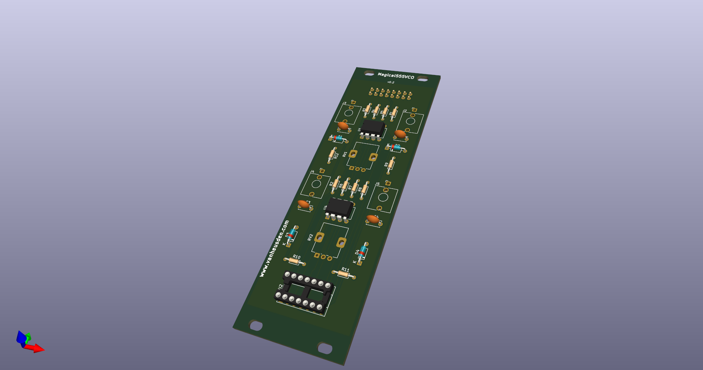
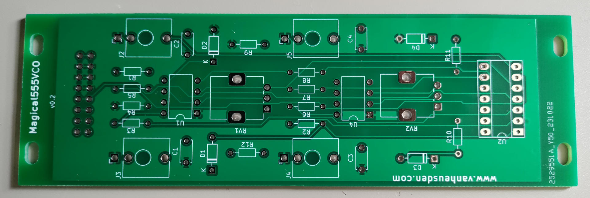
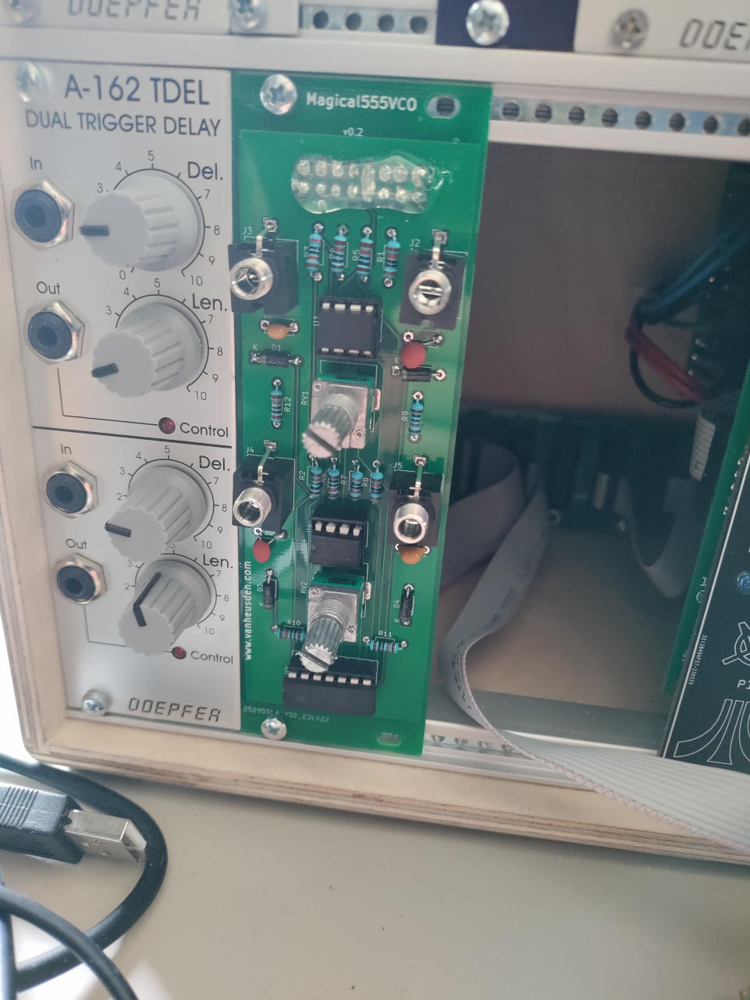
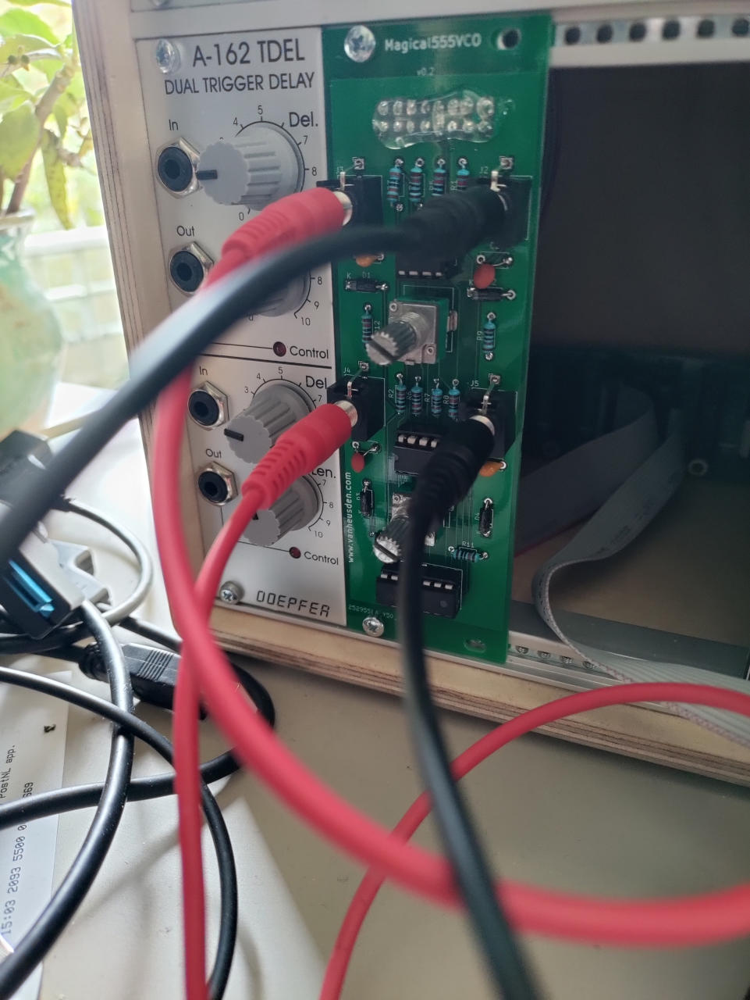

Magical555VCO
-------------

This is a very simple 555 timer based dual VCO.
It fits nicely in any eurorack.

Sample output: https://vanheusden.com/permshare/magical555vco-v0.2.flac
or

* schematics are under media/magical555vco.pdf

Folkert van Heusden <mail@vanheusden.com>
